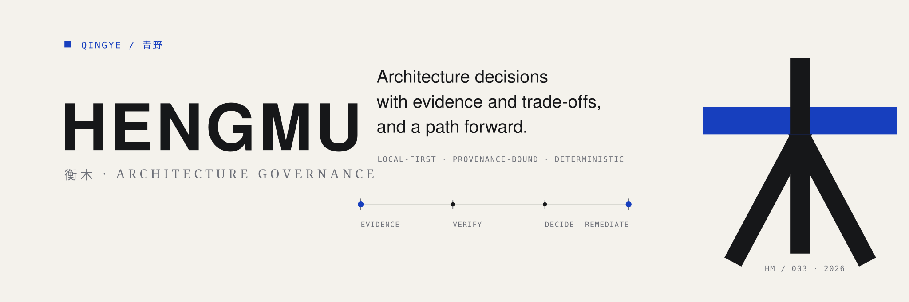
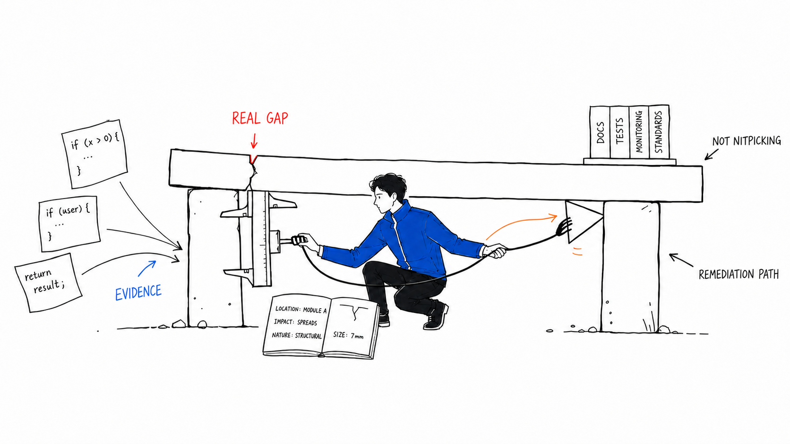
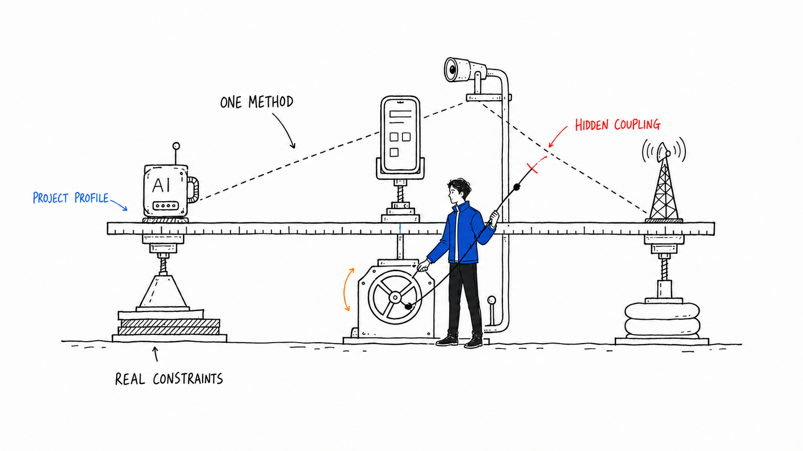

<p align="center">
  
</p>

<p align="center">
  <strong>English</strong> · <a href="README.zh-CN.md">简体中文</a>
</p>

<p align="center">
  <a href="https://github.com/liyanqing90/codex-architecture-governance/actions/workflows/ci.yml">
    
  </a>
  <a href="https://github.com/liyanqing90/codex-architecture-governance/releases">
    
  </a>
  
  <a href="LICENSE">
    
  </a>
</p>

<p align="center">
  <a href="#why-hengmu">Why Hengmu</a> ·
  <a href="#quick-start">Quick start</a> ·
  <a href="#how-it-works">How it works</a> ·
  <a href="#workflows">Workflows</a> ·
  <a href="#trust-model">Trust model</a> ·
  <a href="#documentation">Documentation</a>
</p>

---

Hengmu is a local-first Codex plugin for architecture work that continues
after the first review. It audits what exists, treats missing capability as a
real finding, verifies every claim against evidence, compares viable
solutions, plans remediation, and applies deterministic policy when a project
needs a gate.

It works at two levels:

- one repository, using a project-specific Profile, constraints, critical
  flows, rules, and review history;
- a portfolio of repositories, looking for duplication, stack sprawl, shared
  capability, ownership conflicts, data flows, and hidden coupling.

> [!IMPORTANT]
> **Hengmu** is the public project name. The installable plugin ID, repository
> slug, release archive prefix, and historical provenance remain
> `codex-architecture-governance` during the `0.x` series. Keeping the machine
> identity stable avoids breaking existing installations, Git history anchors,
> and trusted review chains.

## Why Hengmu

Most architecture review tools stop too early: they produce observations.
Hengmu is designed around a longer, evidence-bound chain.

| Typical review failure | Hengmu's response |
| --- | --- |
| A model sees a large file or a singleton and declares an architecture problem. | Candidate findings must survive independent verification and evidence resolution before they become trusted. |
| A missing capability is mentioned as criticism but never designed. | Confirmed gaps flow into solution comparison, remediation slices, rollback, tests, and acceptance criteria. |
| Every project copies the same architecture prompt and slowly diverges. | One global method reads a repository-local Profile and real constraints. |
| Each repository looks reasonable in isolation while the portfolio duplicates infrastructure. | Portfolio review models shared capabilities, dependencies, data flow, ownership, and coupling. |
| A prose policy says “must” but automation cannot prove it. | JSON Schemas, hashes, Git evidence, role policy, fingerprints, signatures, and stable exit codes make enforcement reproducible. |

<p align="center">
  
</p>

Hengmu is intentionally not a generic “best practices” checklist. A rule is
useful only when it protects a declared quality or critical flow, and a
recommendation is useful only when the project can understand its cost,
dependencies, migration order, and stopping conditions.

## Quick start

### 1. Prepare the runtime

Hengmu supports Python 3.11–3.13. The runtime is local: it requires no hosted
service, telemetry, credentials, network access, or MCP server.

```bash
git clone https://github.com/liyanqing90/codex-architecture-governance.git
cd codex-architecture-governance

python3 -m venv .venv
source .venv/bin/activate
python3 -m pip install --require-hashes -r requirements-runtime.lock
python3 scripts/validate_repository.py
```

On Windows PowerShell, activate the environment with:

```powershell
.venv\Scripts\Activate.ps1
```

### 2. Initialize a repository Profile

```bash
HENGMU_ROOT=/path/to/codex-architecture-governance

python3 "$HENGMU_ROOT/resources/scripts/architecture_tool.py" init-project \
  --repo /path/to/your-project \
  --name "Example Project" \
  --type service \
  --quality recoverability \
  --review project-architecture
```

This creates a repository-local control plane:

```text
.architecture/
├── profile.yaml
├── repository-facts.yaml
├── constraints.md
├── critical-flows.md
├── gate-policy.yaml
├── baseline.yaml
├── risk-acceptances.yaml
├── evidence-providers.yaml
├── evidence/
├── rules/
├── runs/
└── reviews/
```

### 3. Run the audit in Codex

```text
Use $project-architecture-audit to audit this repository.
Read .architecture/profile.yaml, constraints.md, and critical-flows.md.
Treat missing capabilities as findings, but verify evidence before
recommending a structural change.
```

The project Profile decides which qualities and specialist reviews matter.
The global Skill provides the method; the repository provides the truth.

```yaml
project:
  name: example-service
  type:
    - ai-agent-platform
  critical_qualities:
    - traceability
    - recoverability
    - privacy
  required_reviews:
    - project-architecture
    - ai-agent-architecture
```

### 4. Validate the result

```bash
python3 "$HENGMU_ROOT/resources/scripts/architecture_tool.py" \
  validate-project /path/to/your-project

python3 "$HENGMU_ROOT/resources/scripts/architecture_tool.py" \
  gate --project /path/to/your-project --stage change
```

The gate returns `0` for pass, `1` for policy failure, and `2` for invalid
input or configuration.

## How it works

Hengmu separates model judgment from deterministic trust. A candidate audit is
useful input, not policy.

<p align="center">
  
</p>

The diagram is maintained as
[Mermaid source](diagrams/en/hengmu-governance-loop.mmd) and an
[editable Excalidraw scene](diagrams/en/hengmu-governance-loop.excalidraw).

1. **Establish facts.** Inspect the repository without turning detected
   technologies or filenames into recommendations.
2. **Load context.** Bind the Profile, constraints, critical flows, selected
   Rule Packs, and task-scoped Knowledge.
3. **Audit.** Produce candidate findings, including material missing
   capability and plausible impact.
4. **Verify.** Challenge each candidate, resolve evidence, and preserve
   rejected hypotheses and limitations.
5. **Decide.** Compare keep-current and structural options against quality,
   business, team, evolution, lock-in, migration risk, and cost.
6. **Remediate.** Turn the accepted option into ordered slices, protections,
   rollback, stop conditions, and acceptance evidence.
7. **Gate.** Apply deterministic contract, finding, change, or release policy
   to provenance-bound artifacts.

## One method, many projects

A repository should not carry a private copy of the architecture method.
Instead, it carries only the context that makes its decisions different:

- `profile.yaml` — project type, critical qualities, and required reviews;
- `constraints.md` — real technical, product, regulatory, and team limits;
- `critical-flows.md` — business and runtime paths that must not regress;
- `reviews/` — candidate, verified, decision, plan, and evidence history.

<p align="center">
  
</p>

Portfolio review adds the missing system-of-systems view: which capabilities
should be shared, which boundaries must remain independent, where data moves,
and where one repository can unexpectedly affect another.

## Workflows

The installable plugin exposes eight focused Skills.

| Phase | Skill | Responsibility |
| --- | --- | --- |
| Audit | `project-architecture-audit` | Boundaries, data ownership, contracts, reliability, security, operations, tests, deployment, debt, and proportionality in one repository. |
| Audit | `ai-agent-architecture-audit` | Models, context, Memory, retrieval, tools, injection, approval, recovery, evaluation, cost, latency, and evidence boundaries. |
| Audit | `mobile-architecture-audit` | Local state, sync, migrations, background work, notifications, privacy, caching, and lifecycle behavior. |
| Audit | `portfolio-architecture-audit` | Duplication, stack sprawl, shared capabilities, dependencies, data flow, ownership, and hidden coupling across projects. |
| Verify | `architecture-finding-verifier` | Challenge candidates, resolve evidence, assign V0–V5 verification, and produce a provenance-bound trusted Review. |
| Decide | `architecture-solution-advisor` | Compare keep-current and structural options against qualities, constraints, team capability, risk, cost, and lock-in. |
| Change | `architecture-remediation-planner` | Convert an accepted decision into migration slices, protections, stop conditions, rollback, and acceptance criteria. |
| Enforce | `architecture-quality-gate` | Apply deterministic contract, finding, change, and release policy to trusted artifacts. |

Knowledge curation is deliberately maintainer-only. Its source workflow lives
under `maintainer/skills/architecture-knowledge-curator/` and does not expand
the public end-user Skill surface.

## Trust model

Hengmu's trust boundary is simple:

> A model may propose. Evidence, authority, provenance, and policy decide what
> can become trusted or blocking.

A trusted Review binds the reviewed repository identity and Git state, exact
scope, Profile, repository facts, selected Knowledge, Rule Packs, candidate
review, verifier authority, semantic Finding fingerprints, critical-flow
coverage, and resolvable evidence.

The deterministic runtime provides:

- JSON Schemas for project, review, decision, plan, policy, baseline, risk
  acceptance, Knowledge, provider, benchmark, and governance artifacts;
- machine-readable core and domain Rule Packs with complete-coverage checks;
- sourced Knowledge Packs selected under explicit context budgets;
- opt-in Evidence Providers with no-shell execution, safe environment
  allowlists, timeouts, structured-output validation, and tamper-evident run
  records;
- Git evidence resolution, exact hashes, signature verification, SARIF, review
  diffing, artifact migration, benchmark scoring, and layered gates.

Gate stages are cumulative:

| Stage | Proves |
| --- | --- |
| `contract` | Schemas, provenance, identity, hashes, roles, and coverage are valid. |
| `finding` | Severity, confidence, verification, status, baseline, waiver, and risk acceptance satisfy policy. |
| `change` | Review freshness, changed contracts, required decisions, migration compatibility, signatures, and evidence resolution are acceptable. |
| `release` | Required evidence, decision authority, and complete remediation acceptance are present. |

Read the [assurance model](docs/assurance-model.md) for threats, controls, and
residual risk. A passing gate proves policy evaluation of supplied artifacts;
it does not prove that the audited product is correct, secure, compliant, or
well designed.

<details>
<summary>Trusted review and evidence commands</summary>

```bash
python3 resources/scripts/architecture_tool.py review-bindings \
  --project /path/to/project \
  --candidate .architecture/reviews/example-candidates.yaml

python3 resources/scripts/architecture_tool.py validate-review \
  /path/to/verified.yaml --project /path/to/project

python3 resources/scripts/architecture_tool.py verify-evidence \
  --repo /path/to/project --review /path/to/verified.yaml

python3 resources/scripts/architecture_tool.py verify-review-signature \
  --project /path/to/project --review /path/to/verified.yaml
```

</details>

<details>
<summary>Task-scoped Knowledge selection</summary>

```bash
python3 resources/scripts/architecture_tool.py inspect-repository \
  --repo /path/to/project \
  --output /path/to/project/.architecture/repository-facts.yaml

python3 resources/scripts/architecture_tool.py select-knowledge \
  --facts /path/to/project/.architecture/repository-facts.yaml \
  --profile /path/to/project/.architecture/profile.yaml \
  --task "Current architecture audit" \
  --skill project-architecture-audit \
  --output /path/to/project/.architecture/knowledge-selection.yaml \
  --context-output /path/to/project/.architecture/knowledge-context.yaml

python3 resources/scripts/architecture_tool.py validate-knowledge-context \
  /path/to/project/.architecture/knowledge-context.yaml \
  --selection /path/to/project/.architecture/knowledge-selection.yaml \
  --facts /path/to/project/.architecture/repository-facts.yaml \
  --profile /path/to/project/.architecture/profile.yaml
```

</details>

## Governance modes

Not every project needs the same ceremony.

| Mode | Use when | Behavior |
| --- | --- | --- |
| Advisory | The project needs structured architecture help without a blocking gate. | Skills produce evidence-backed artifacts; maintainers retain full judgment. |
| Governed | Important changes need trusted review, explicit decisions, and change policy. | Provenance, authority, freshness, and Finding policy are enforced. |
| Enforced | Releases require deterministic architecture evidence and completed remediation. | Change and release gates become required delivery controls. |

See [governance modes](docs/governance-modes.md) for adoption guidance.
`product_mode` is a declared operating tier, not a bypass: an explicitly
invoked gate always evaluates its policy.

## Documentation

| Read this | When you need |
| --- | --- |
| [Target architecture](docs/target-architecture.md) | Facts, Knowledge, workflow, trust boundaries, and runtime components. |
| [Assurance model](docs/assurance-model.md) | Threats, guarantees, non-guarantees, and residual risk. |
| [Governance modes](docs/governance-modes.md) | Advisory, Governed, and Enforced adoption. |
| [Evaluation guide](docs/evaluation.md) | Behavior benchmarks, ablation, scoring, and interpretation limits. |
| [Knowledge authoring](docs/knowledge-authoring.md) | Source quality, freshness, frontmatter, and curation rules. |
| [Compatibility](docs/compatibility.md) | Supported Python, schemas, artifacts, and version boundaries. |
| [0.4.2 migration](docs/migrating-to-0.4.2.md) | Context precision, historical artifacts, and current-runtime requirements. |
| [Release verification](docs/releasing.md) | Deterministic ZIPs, checksums, SBOMs, and attestations. |
| [Implementation matrix](docs/comprehensive-review-implementation.md) | How review recommendations map to executable capability and evidence. |
| [Dogfood review history](.architecture/reviews/README.md) | How Hengmu governs its own repository. |
| [Visual assets](docs/assets/brand/README.md) | Bilingual icon, banner, editorial character, and diagram source conventions. |

Accepted architecture decisions live in [docs/decisions](docs/decisions/).
The repository's implemented target state is tracked in the
[target architecture implementation matrix](docs/target-architecture-implementation.md).

## Development

```bash
python3 -m venv .venv
source .venv/bin/activate
python3 -m pip install --require-hashes -r requirements-dev.lock

python3 scripts/validate_repository.py
python3 resources/scripts/architecture_tool.py validate-project .
python3 resources/scripts/architecture_tool.py validate-history-anchors .
python3 resources/scripts/validate_knowledge.py
python3 -m pytest
python3 resources/scripts/architecture_tool.py gate --project . --stage change
python3 -m ruff check .
python3 -m ruff format --check .
python3 scripts/audit_licenses.py
```

Build and verify the deterministic plugin archive:

```bash
python3 scripts/package_plugin.py --output-dir dist
python3 scripts/verify_checksum.py dist/*.zip.sha256
python3 scripts/generate_sbom.py \
  --archive dist/codex-architecture-governance-0.4.2.zip \
  --output dist/codex-architecture-governance-0.4.2.spdx.json
```

CI runs the supported Python boundary on Linux, macOS, and Windows. Tagged
releases publish a deterministic ZIP, SHA-256 checksum, SPDX SBOM, and GitHub
provenance/SBOM attestations.

## Non-goals

Hengmu does not:

- autonomously approve architecture decisions, risk, or releases;
- turn every detected technology, pattern, or large file into a Finding;
- discover unrelated repositories without an explicit portfolio registry;
- implement the audited product's remediation by itself;
- replace dedicated security, privacy, performance, legal, or compliance
  assessment;
- prove that a system is secure or correct.

## Contributing

Focused issues and pull requests are welcome. Start with
[CONTRIBUTING.md](CONTRIBUTING.md), then read
[GOVERNANCE.md](GOVERNANCE.md), [SECURITY.md](SECURITY.md), and
[SUPPORT.md](SUPPORT.md).

Changes to public schemas, CLI behavior, policy, trust boundaries, or persisted
artifacts require compatibility analysis, tests, migration notes, and an
updated architecture decision when authority changes.

When a Review or Selector Runtime binds source commits, preserve those commits
with a Merge Commit. Squash or rebase merging can invalidate source ancestry
and is rejected by `validate-history-anchors`.

## Credits and license

Hengmu is a [Qingye](https://github.com/liyanqing90) open-source project:
**理性结构中的持续进化，在不确定中，持续构建。**

The README's editorial illustration system was created with
[Ian Xiaohei Illustrations](https://github.com/helloianneo/ian-xiaohei-illustrations)
and recast with an original Qingye builder character derived from the public
Qingye avatar and brand palette. The technical flow is
available as Mermaid, Excalidraw, SVG, and PNG so documentation remains
editable.

PAAD-derived concepts retain attribution in [NOTICE](NOTICE) and
[third_party/PAAD-MIT.txt](third_party/PAAD-MIT.txt).

The software is licensed under the [MIT License](LICENSE). The Qingye wordmark
identifies the originating project and is not a grant to imply endorsement.
