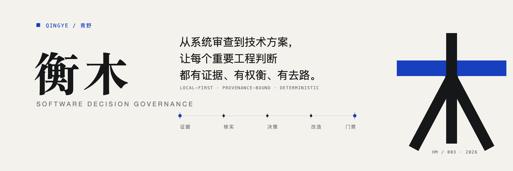
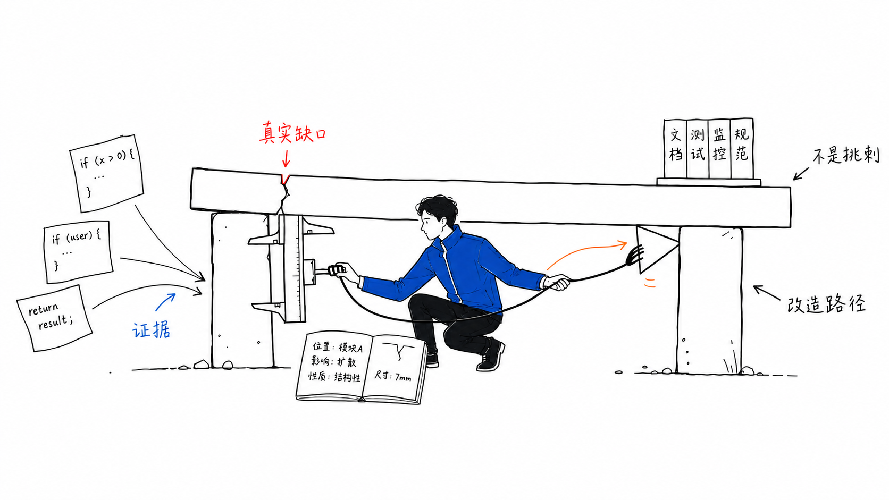
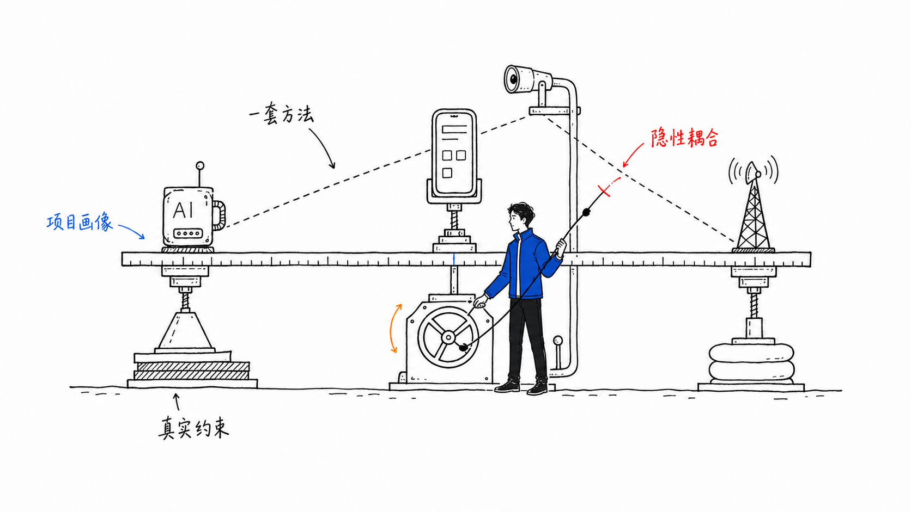

<p align="center">
  
</p>

<p align="center">
  <a href="README.md">English</a> · <strong>简体中文</strong>
</p>

<p align="center">
  <a href="https://github.com/liyanqing90/hengmu/actions/workflows/ci.yml">
    
  </a>
  <a href="https://github.com/liyanqing90/hengmu/releases">
    
  </a>
  
  <a href="LICENSE">
    
  </a>
</p>

<p align="center">
  <a href="#为什么选择衡木">为什么选择衡木</a> ·
  <a href="#快速开始">快速开始</a> ·
  <a href="#工作原理">工作原理</a> ·
  <a href="#工作流">工作流</a> ·
  <a href="#信任模型">信任模型</a> ·
  <a href="#文档">文档</a>
</p>

---

衡木是一个本地优先、受证据约束的软件工程决策系统。它打通了从系统审查、
问题独立核实到技术方案决策、改造规划和确定性质量门禁的完整闭环。

架构是连接这些问题的系统视角，不是衡木唯一评估或决策的对象。当前审查规则
覆盖性能效率、可靠性、安全与隐私边界、数据与 API 契约、可观测性、测试、
部署、技术债和设计比例性；方案决策能力还支持目标架构、技术选型、模式比较，
以及新项目或问题改造场景下的方案权衡。

它同时覆盖两个层级：

- 单个仓库：读取项目自己的 Profile、约束、关键链路、规则和审核历史；
- 项目组合：识别重复建设、技术栈扩散、共享能力、所有权冲突、
  项目间数据流和隐性耦合。

| 能力 | 衡木做什么 |
| --- | --- |
| 系统审查 | 审查结构与工程质量，包括有运行证据支撑的性能预算和运行行为。 |
| 技术方案 | 比较维持现状与结构性方案，权衡质量、成本、复杂度、成熟度、锁定、迁移风险和可逆性。 |
| 专项审查 | 为 AI Agent、移动应用和多项目组合提供专门检查视角。 |
| 决策治理 | 把事实、证据、来源、权限、改造与确定性策略绑定为可审计链路。 |

## 为什么选择衡木

多数代码与架构评审停得太早：它们只输出观察意见。衡木围绕一条更长、
且始终受证据约束的工程决策闭环设计。

| 常见审核失效方式 | 衡木的应对 |
| --- | --- |
| 模型看到大文件或单例，就直接认定架构有问题。 | 候选问题必须经过独立核实和证据解析，才能成为可信结论。 |
| 缺失能力只被当作批评，却没有形成设计。 | 已确认缺口会进入方案比较、改造切片、回滚、测试和验收标准。 |
| 每个项目复制同一份架构提示词，随后逐渐分叉。 | 一套全局方法读取仓库本地的 Profile 和真实约束。 |
| 单看每个仓库都合理，放在一起却重复建设基础设施。 | 项目组合审核会建模共享能力、依赖、数据流、所有权和耦合。 |
| 文字策略写了“必须”，自动化却无法证明。 | JSON Schema、哈希、Git 证据、角色策略、指纹、签名和稳定退出码让执行可以复现。 |

<p align="center">
  
</p>

衡木不是一份通用“最佳实践”清单。规则只有在保护已声明的质量属性或关键链路时
才有意义；建议只有在项目能理解成本、依赖、迁移顺序和停止条件时才有价值。

## 快速开始

### 1. 准备运行环境

衡木支持 Python 3.11–3.13。运行时完全本地，不依赖托管服务、遥测、
凭据、网络访问或 MCP Server。

```bash
git clone https://github.com/liyanqing90/hengmu.git
cd hengmu

python3 -m venv .venv
source .venv/bin/activate
python3 -m pip install --require-hashes -r requirements-runtime.lock
python3 scripts/validate_repository.py
```

Windows PowerShell 使用以下命令激活环境：

```powershell
.venv\Scripts\Activate.ps1
```

### 2. 初始化仓库 Profile

```bash
HENGMU_ROOT=/path/to/hengmu

python3 "$HENGMU_ROOT/resources/scripts/architecture_tool.py" init-project \
  --repo /path/to/your-project \
  --name "Example Project" \
  --type service \
  --quality recoverability \
  --review project-architecture
```

命令会创建一套仓库本地控制面：

```text
.architecture/
├── profile.yaml
├── repository-facts.yaml
├── constraints.md
├── critical-flows.md
├── gate-policy.yaml
├── baseline.yaml
├── risk-acceptances.yaml
├── evidence-providers.yaml
├── evidence/
├── rules/
├── runs/
└── reviews/
```

### 3. 在 Codex 中运行审计

```text
使用 $project-architecture-audit 审计当前仓库。
读取 .architecture/profile.yaml、constraints.md 和 critical-flows.md。
把缺失能力作为问题，但在建议结构性改动前先核实证据。
```

项目 Profile 决定哪些质量属性和专项审核真正重要。全局 Skill 提供方法，
仓库提供事实。

```yaml
project:
  name: example-service
  type:
    - ai-agent-platform
  critical_qualities:
    - traceability
    - recoverability
    - privacy
  required_reviews:
    - project-architecture
    - ai-agent-architecture
```

### 4. 验证结果

```bash
python3 "$HENGMU_ROOT/resources/scripts/architecture_tool.py" \
  validate-project /path/to/your-project

python3 "$HENGMU_ROOT/resources/scripts/architecture_tool.py" \
  gate --project /path/to/your-project --stage change
```

门禁退出码：`0` 表示通过，`1` 表示策略不通过，`2` 表示输入或配置无效。

## 工作原理

衡木把模型判断与确定性信任分开。候选审计是有价值的输入，但它本身不是策略。

<p align="center">
  
</p>

该图同时维护
[Mermaid 源文件](diagrams/zh-CN/hengmu-governance-loop.mmd)和
[可编辑 Excalidraw 文件](diagrams/zh-CN/hengmu-governance-loop.excalidraw)。

1. **建立事实。** 检查仓库，但不把检测到的技术或文件名直接变成建议。
2. **加载上下文。** 绑定 Profile、约束、关键链路、已选择 Rule Pack 和任务范围内的 Knowledge。
3. **执行审计。** 产出候选问题，包括重要的缺失能力及其可能影响。
4. **独立核实。** 挑战每个候选问题，解析证据，并保留被否定的假设和局限。
5. **比较决策。** 围绕质量、业务、团队、演进、锁定、迁移风险和成本，
   比较维持现状与结构性方案。
6. **规划改造。** 把已接受方案拆成有顺序的切片、保护措施、回滚、
   停止条件和验收证据。
7. **执行门禁。** 对绑定来源的产物应用确定性的契约、问题、变更或发布策略。

## 一套方法，多个项目

仓库不应该各自保存一份架构方法副本。它只需要保存让自身决策与其他项目不同的上下文：

- `profile.yaml`：项目类型、关键质量属性和必需审核；
- `constraints.md`：真实的技术、产品、监管和团队限制；
- `critical-flows.md`：不能回归的业务和运行链路；
- `reviews/`：候选、核实、决策、计划和证据历史。

<p align="center">
  
</p>

项目组合审核补上系统之系统视角：哪些能力应该共享，哪些边界必须独立，
数据如何流动，以及一个仓库可能在哪里意外影响另一个仓库。

## 工作流

可安装插件公开八个聚焦的 Skill。

| 阶段 | Skill | 职责 |
| --- | --- | --- |
| 审计 | `project-architecture-audit` | 单仓库中的边界、数据所有权、契约、可靠性、安全、运维、测试、部署、技术债和比例性。 |
| 审计 | `ai-agent-architecture-audit` | 模型、Context、Memory、检索、工具、注入、审批、恢复、评估、成本、延迟和证据边界。 |
| 审计 | `mobile-architecture-audit` | 本地状态、同步、迁移、后台任务、通知、隐私、缓存和生命周期行为。 |
| 审计 | `portfolio-architecture-audit` | 跨项目的重复建设、技术栈扩散、共享能力、依赖、数据流、所有权和隐性耦合。 |
| 核实 | `architecture-finding-verifier` | 挑战候选问题、解析证据、分配 V0–V5 核实等级，并产出绑定来源的可信 Review。 |
| 决策 | `architecture-solution-advisor` | 围绕质量、约束、团队能力、风险、成本和锁定，比较维持现状与结构性方案。 |
| 变更 | `architecture-remediation-planner` | 把接受的决策转成迁移切片、保护、停止条件、回滚和验收标准。 |
| 执行 | `architecture-quality-gate` | 对可信产物应用确定性的契约、问题、变更和发布策略。 |

Knowledge 策展仅供维护者使用。其源工作流位于
`maintainer/skills/architecture-knowledge-curator/`，不会扩大公开的最终用户 Skill 表面。

## 信任模型

衡木的信任边界很简单：

> 模型可以提出建议；证据、权限、来源和策略决定什么可以成为可信结论或阻断条件。

可信 Review 会绑定被审查仓库的身份与 Git 状态、精确范围、Profile、
仓库事实、已选择 Knowledge、Rule Pack、候选审核、核实者权限、语义 Finding
指纹、关键链路覆盖和可解析证据。

确定性运行时提供：

- 项目、Review、Decision、Plan、策略、基线、风险接受、Knowledge、
  Provider、Benchmark 和治理产物的 JSON Schema；
- 可机器读取的核心与领域 Rule Pack，以及完整覆盖检查；
- 在明确上下文预算内选择、带来源的 Knowledge Pack；
- 可选 Evidence Provider：禁止 Shell、环境变量白名单、超时、结构化输出校验和防篡改运行记录；
- Git 证据解析、精确哈希、签名验证、SARIF、Review Diff、产物迁移、
  Benchmark 评分和分层门禁。

门禁阶段逐级累积：

| 阶段 | 证明内容 |
| --- | --- |
| `contract` | Schema、来源、身份、哈希、角色和覆盖有效。 |
| `finding` | 严重度、置信度、核实、状态、基线、豁免和风险接受符合策略。 |
| `change` | Review 新鲜度、已变更契约、必要决策、迁移兼容性、签名和证据解析可接受。 |
| `release` | 必需证据、决策权限和完整改造验收已经具备。 |

请阅读[保障模型](docs/assurance-model.md)，了解威胁、控制和剩余风险。
门禁通过只证明已提供产物满足策略，不证明被审计产品正确、安全、合规或设计优秀。

<details>
<summary>可信 Review 与证据命令</summary>

```bash
python3 resources/scripts/architecture_tool.py review-bindings \
  --project /path/to/project \
  --candidate .architecture/reviews/example-candidates.yaml

python3 resources/scripts/architecture_tool.py validate-review \
  /path/to/verified.yaml --project /path/to/project

python3 resources/scripts/architecture_tool.py verify-evidence \
  --repo /path/to/project --review /path/to/verified.yaml

python3 resources/scripts/architecture_tool.py verify-review-signature \
  --project /path/to/project --review /path/to/verified.yaml
```

</details>

<details>
<summary>任务范围内的 Knowledge 选择</summary>

```bash
python3 resources/scripts/architecture_tool.py inspect-repository \
  --repo /path/to/project \
  --output /path/to/project/.architecture/repository-facts.yaml

python3 resources/scripts/architecture_tool.py select-knowledge \
  --facts /path/to/project/.architecture/repository-facts.yaml \
  --profile /path/to/project/.architecture/profile.yaml \
  --task "Current architecture audit" \
  --skill project-architecture-audit \
  --output /path/to/project/.architecture/knowledge-selection.yaml \
  --context-output /path/to/project/.architecture/knowledge-context.yaml

python3 resources/scripts/architecture_tool.py validate-knowledge-context \
  /path/to/project/.architecture/knowledge-context.yaml \
  --selection /path/to/project/.architecture/knowledge-selection.yaml \
  --facts /path/to/project/.architecture/repository-facts.yaml \
  --profile /path/to/project/.architecture/profile.yaml
```

</details>

## 治理模式

不是每个项目都需要相同的治理强度。

| 模式 | 适用场景 | 行为 |
| --- | --- | --- |
| Advisory | 项目需要结构化架构帮助，但不需要阻断门禁。 | Skill 产出有证据的产物；维护者保留全部判断权。 |
| Governed | 重要变更需要可信审核、明确决策和变更策略。 | 强制来源、权限、新鲜度和 Finding 策略。 |
| Enforced | 发布必须具备确定性架构证据并完成改造验收。 | 变更和发布门禁成为交付要求。 |

采用建议请参阅[治理模式](docs/governance-modes.md)。`product_mode`
只是声明的运行层级，不是绕过机制：只要明确调用门禁，就会执行其策略。

## 文档

| 文档 | 何时阅读 |
| --- | --- |
| [目标架构](docs/target-architecture.md) | 事实、Knowledge、工作流、信任边界和运行时组件。 |
| [保障模型](docs/assurance-model.md) | 威胁、保证、不保证的内容和剩余风险。 |
| [治理模式](docs/governance-modes.md) | Advisory、Governed 和 Enforced 的采用方式。 |
| [评估指南](docs/evaluation.md) | 行为 Benchmark、消融、评分和解释边界。 |
| [Knowledge 编写](docs/knowledge-authoring.md) | 来源质量、新鲜度、Frontmatter 和策展规则。 |
| [兼容性](docs/compatibility.md) | 支持的 Python、Schema、产物和版本边界。 |
| [迁移到 0.4.2](docs/migrating-to-0.4.2.md) | 上下文精度、历史产物和当前运行时要求。 |
| [发布验证](docs/releasing.md) | 确定性 ZIP、校验和、SBOM 和 Attestation。 |
| [实施矩阵](docs/comprehensive-review-implementation.md) | 审核建议如何映射为可执行能力与证据。 |
| [自审历史](.architecture/reviews/README.md) | 衡木如何治理自身仓库。 |
| [视觉资产](docs/assets/brand/README.md) | 双语 Icon、Banner、青野角色和流程图源文件规范。 |

已接受的架构决策位于 [docs/decisions](docs/decisions/)。
仓库目标状态的实施进展记录在
[目标架构实施矩阵](docs/target-architecture-implementation.md)。

## 开发

```bash
python3 -m venv .venv
source .venv/bin/activate
python3 -m pip install --require-hashes -r requirements-dev.lock

python3 scripts/validate_repository.py
python3 resources/scripts/architecture_tool.py validate-project .
python3 resources/scripts/architecture_tool.py validate-history-anchors .
python3 resources/scripts/validate_knowledge.py
python3 -m pytest
python3 resources/scripts/architecture_tool.py gate --project . --stage change
python3 -m ruff check .
python3 -m ruff format --check .
python3 scripts/audit_licenses.py
```

构建并验证确定性插件压缩包：

```bash
python3 scripts/package_plugin.py --output-dir dist
python3 scripts/verify_checksum.py dist/*.zip.sha256
python3 scripts/generate_sbom.py \
  --archive dist/hengmu-0.4.2.zip \
  --output dist/hengmu-0.4.2.spdx.json
```

CI 会在 Linux、macOS 和 Windows 上验证支持的 Python 边界。带 Tag 的发布
会提供确定性 ZIP、SHA-256 校验和、SPDX SBOM，以及 GitHub 来源和 SBOM
Attestation。

## 非目标

衡木不会：

- 自主批准架构决策、风险或发布；
- 把每个检测到的技术、模式或大文件都变成 Finding；
- 在没有明确项目组合 Registry 的情况下发现无关仓库；
- 自动实现被审计产品的改造；
- 取代专门的安全、隐私、性能、法律或合规评估；
- 证明系统绝对安全或正确。

## 参与贡献

欢迎聚焦的问题和 Pull Request。请先阅读
[CONTRIBUTING.md](CONTRIBUTING.md)，再阅读
[GOVERNANCE.md](GOVERNANCE.md)、[SECURITY.md](SECURITY.md) 和
[SUPPORT.md](SUPPORT.md)。

修改公开 Schema、CLI 行为、策略、信任边界或持久化产物时，必须分析兼容性、
补充测试和迁移说明；权限发生变化时还必须更新架构决策。

当 Review 或 Selector Runtime 绑定源提交时，请使用 Merge Commit 保留这些提交。
Squash 或 Rebase 合并可能破坏来源祖先关系，并会被
`validate-history-anchors` 拒绝。

## 致谢与许可证

衡木是一个[青野](https://github.com/liyanqing90)开源项目：
**理性结构中的持续进化，在不确定中，持续构建。**

README 的正文插画方法由
[Ian Xiaohei Illustrations](https://github.com/helloianneo/ian-xiaohei-illustrations)
提供，并以青野公开头像和品牌配色重新设计了原创青野角色。技术流程同时提供
Mermaid、Excalidraw、SVG 和 PNG，确保文档可以继续编辑。

PAAD 衍生概念的署名保留在 [NOTICE](NOTICE) 和
[third_party/PAAD-MIT.txt](third_party/PAAD-MIT.txt)。

软件采用 [MIT License](LICENSE)。青野字标用于标识项目来源，
不授予任何暗示青野认可或背书的权利。
